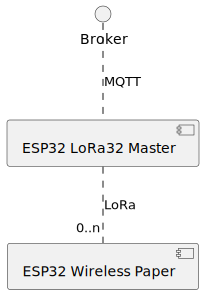
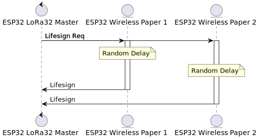

# ESP32-LoRa

## Use Case

Using different ESP32 modules I am creating a simple LoRa network consisting of a gateway/master device and multiple end-point/slave devices. The gateway acts as a master and connects to the slaves using a simple request/response protocol. The gateway also connects to a MQTT broker via WiFi to make the devices available for further automations.

## Hardware

### LilyGo LoRa32

For the master/gateway I use a [LilyGo LoRa32](https://github.com/LilyGO/TTGO-LORA32/tree/LilyGO-V1.3-868). Bluetooth is not (yet?) used, but LoRa and WiFi is. Also some basic stats are displayed on the LCD.

### Heltec Wireless Paper

The end-point devices are currently only [Wireless Papers](https://heltec.org/project/wireless-paper/) from Heltec. They have WiFi ant Bluetooth too, but only LoRa is used.

Additional Info:

- [Schematic](https://resource.heltec.cn/download/Wireless_Paper/Wireless_Paper_V0.4_Schematic_Diagram.pdf)
- [Product Page SX1262](https://www.semtech.com/products/wireless-rf/lora-connect/sx1262)

## Software

### LoRaDisplay

The ESP32 SW for the Heltec Wireless Paper. Unfortunately Heltecs Lib is only useable with Arduino, so it is a Arduino Software. But maybe I am switching to Micropython...

More info [here](doc/loradisplay.md)

Additional software used:

- [Heltec ESP32 Libs](https://github.com/HelTecAutomation/Heltec_ESP32)

### LoRaGateway

A ESP32 SW for the LilyGo to connect LoRa Devices with a MQTT broker.

Additional software used:

- [Espressif ESP-IDF v5.2.2](https://docs.espressif.com/projects/esp-idf/en/stable/esp32/get-started/index.html)
- [nopnop2002s LoRa Lib](https://github.com/nopnop2002/esp-idf-sx127x.git)

## Software Description

### Device Discovery - On Start

Slaves send out a Lifesign Broadcast Message on power-up

### Device Discovery - While running

1. The master sends a Lifesign Request Message in fixed intervals
2. Slaves wait for a random time when the request is received and then transmit a Lifesign Response Message

### Protocol

More info about the communication protocol [here](doc/protocol.md)

## TODO

- [X] Basic Master OS
- [X] Basic Slave OS
- [X] Master: Generic TX for testing
- [X] Master: Generic RX for testing
- [X] Master: Cyclic lifesign request
- [X] Master: Detections of lifesigns
- [ ] Master: Keep list of detected devices
- [ ] Master: Cyclic status requests to known devices
- [ ] Master: Remove detected devices on status timeouts
- [ ] Master: WiFi
- [ ] Master: MQTT connectivity
- [ ] Master: MQTT list of known devices
- [ ] Master: MQTT device tree with status
- [ ] Master: MQTT Read device endpoints
- [ ] Master: MQTT Write device endpoints
- [ ] Master: LCD functionality
- [ ] Master: LCD show WiFi connectivity
- [ ] Master: LCD show MQTT connectivity
- [ ] Master: LCD show number of known devices
- [X] Slave: Generic RX for testing
- [X] Slave: Generic TX for testing
- [X] Slave: Lifesign on start
- [X] Slave: Lifesign on request
- [ ] Slave: Send status response
- [ ] Slave: Read endpoint functionality
- [ ] Slave: Write endpoint functionality
- [ ] Slave: Display driver
- [ ] Slave: Display endpoint
